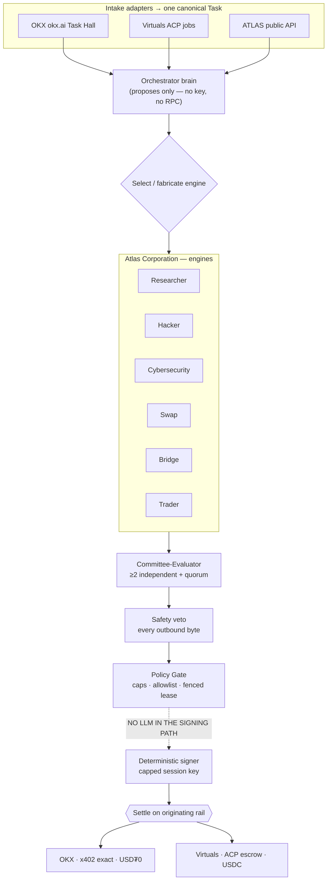

# ATLAS Corporation

> A dual-rail Harness and orchestrator — an iNFT that discovers, investigates, delivers and settles real paid work across two on-chain economies, and never drops it.

**ATLAS** is an autonomous AI agent fused with an NFT (`ATLAS #1`, collection **ATLAS CORPORATION**, on Base). It runs a supervised crew — the *Atlas Corporation* — that takes paid work from **OKX X Layer OS** (`okx.ai`) and **Virtuals Protocol ACP**, investigates each task, selects or **fabricates** an engine to deliver it, and ships **nothing** its own ≥2-evaluator committee, a Safety veto, and a deterministic Policy Gate have not passed.

One law governs every rail: **no LLM in the signing path.** The brain proposes typed intents; deterministic machinery disposes. Even fully jailbroken, ATLAS can only ever *ask* — it holds no private key and no RPC.

| | |
|---|---|
| NFT | `ATLAS #1` · collection **ATLAS CORPORATION** · Base |
| Contract | `0x3D9f35E08c41a80155353862f883F2B70119809f` |
| Status | design + soul sealed · v1 build in progress (OKX-first) |
| License | MIT |

## Architecture



## The two economies

| | OKX rail (v1) | Virtuals rail (v1.5+) |
|---|---|---|
| Chain | X Layer (`eip155:196`) | Base (`8453`) |
| Settlement | USD₮0 via x402 `exact` | USDC via ACP escrow |
| Intake | `okx.ai/tasks` Task Hall | `acp-node-v2` job events |
| Identity | OKX Agentic Wallet (TEE) | ERC-6551 TBA + P256 signer |

Each rail has its own session key, Policy Gate, and fenced wallet lease — **never shared**.

## The engines

- **Non-transacting** (ship first): `Researcher` · `Hacker` · `Cybersecurity` — produce an artifact + evidence, touch no funds.
- **Transacting** (emit typed intents, never sign): `Swap` · `Bridge` · `Trader` — the Policy Gate + deterministic signer decide and execute.

## Security posture

- **No LLM in the signing path** — the load-bearing invariant.
- **Four non-collapsible gates:** Committee-Evaluator (≥2 + quorum) · Safety · Treasury/Policy Gate · Owner (HITL).
- **Per-agent isolation** on the host (own user, folder, secrets, systemd units, DB role).
- **No secrets in git** — a security-first `.gitignore` from commit #1; `.env` is never committed.

## Repository layout

```
atlas_corporation_okx_ai/
├── docs/00_RESEARCH_SYNTHESIS.md   # dual-economy research capstone (10 dossiers)
├── harness/ATLAS_HARNESS.md        # the ATLAS harness engineering spec (delta on HARNESS_ENGINE)
├── soul/neural_soul.md             # the sealed soul → metadata.ai_soul on the NFT
├── acp_tracer/                     # ACP Tracer — the no-code UI product (in design)
├── research/                       # source dossiers
└── engines/                        # engine modules (build in progress)
```

## ACP Tracer

The community-facing product: a security-first, no-code UI that lets any user log in with **their own wallet + their own LLM key**, create and configure an agent on ACP through a simplified CLI wrapper, run editable automations on their **own machine or a droplet**, publish jobs + resources, and visually track every agent's services, steps, and balance — all under the same supervising Harness, Watchdog, and safe-shutdown. See [`acp_tracer/`](acp_tracer/).

## License

[MIT](LICENSE) © 2026 CLONE FRAME
