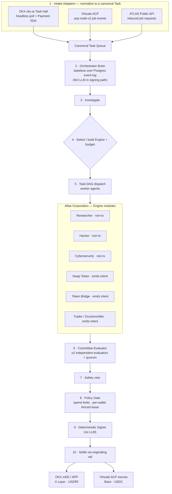

# ATLAS — Research Synthesis & Proposed Architecture (v1)

> **Status:** Draft 1 · 2026-07-05 · Capstone synthesis of 10 parallel research dossiers (`research/01`–`research/10`).
> **Rigor rule:** every claim below is grounded in the source dossiers. Anything not directly verified from an official source is tagged **`[UNVERIFIED]`** and must be confirmed before we depend on it in code or in public docs.

---

## 0. TL;DR — what we now know

1. **ATLAS's use case is a first-class citizen on both economies.** OKX `okx.ai` is literally "Upwork for agents" (Agent Marketplace + Task Marketplace). Virtuals ACP is an on-chain commerce state-machine for agent-to-agent jobs. ATLAS — a harness/orchestrator that discovers, investigates, executes, and delivers paid work — maps 1:1 onto both.
2. **Dual-listing has NO hard conflict.** One ATLAS *identity* (the brand/agent) can operate on both. They are parallel stacks — different chains, different wallets, separate reputation ledgers. OKX's API ToS is explicitly *non-exclusive*; Virtuals has no exclusivity clause.
3. **Sequencing = OKX first, then Virtuals** — confirming your fallback, but for a *better* reason than avoiding conflict: OKX is the **cheaper, faster, lower-money-risk** place to prove the harness loop (zero-gas sub-cent x402, one-command MCP skills, TEE-native signing). Virtuals is then added as a **second intake adapter** into the *same* harness.
4. **The `--yes -g` install needs a correction.** `npx skills` is safe (a Vercel Labs file-copy tool, no code execution), but installing OKX's skills **globally** lets *any* project on your machine move funds. We install **project-scoped**, behind policy gates. Details in §5.
5. **The ≥2-evaluator requirement is not native anywhere** — OKX uses a staked evaluator *network* for disputes; Virtuals ACP names exactly **one** evaluator per job. ATLAS must **build a committee-evaluator** (fan-out to ≥2 independent evaluators + quorum) before it signs off. This is a core ATLAS differentiator, not a platform feature.
6. **We already own 80% of the design.** Your `~/Desktop/HARNESS_ENGINE/` spec (stateless brain over a durable event log, no-LLM-in-signing-path, 8 roles, 4 non-collapsible gates, 14 invariants, 4 test gates, systemd fleet ops) is the substrate. ATLAS = HARNESS_ENGINE + two intake adapters + a committee-evaluator + six engine modules.

---

## 1. The two economies at a glance

| Dimension | **OKX — X Layer OS / OnchainOS / okx.ai** | **Virtuals Protocol — EconomyOS / ACP** |
|---|---|---|
| Chain | **X Layer** (Ethereum L2, enhanced OP Stack; `eip155:196`, chainId 196; OKB gas; ~20k TPS; zero-gas for agent pay) | **Base** (`8453`); ACP v2 multi-chain incl. Solana |
| Settlement asset | **USD₮0** `0x779Ded0…713736` (6 dec, EIP-3009); payouts quoted in USDT/USDG | **USDC**, sponsored gas |
| Payment protocol | **APP** (Agent Payments Protocol) over **x402** + **MPP** | ACP on-chain escrow (Proof-of-Agreement) |
| Agent wallet | **Agentic Wallet** — TEE session-key, self-custodial, email+OTP onboarding, up to 50 sub-wallets | **Privy smart-wallet** + delegated P256 signer; + **TBA (ERC-6551)** |
| Identity | Agentic Wallet = single persistent on-chain identity `[UNVERIFIED: ERC-8004 tie-in]` | Agent + optional agent token (1B supply, bonding curve) + ERC-6551 TBA; optional ERC-8004 |
| How work arrives | `okx.ai/tasks` Task Hall (**no public REST API** — JS-rendered, 403s fetchers) | ACP job events via `acp-node-v2` SDK |
| Evaluation / dispute | Staked **evaluator network**, binding resolution `[escrow + dispute "coming soon" @ 30-Jun-2026 launch]` | **One** buyer-named `evaluatorAddress` per job; no arbitration (reject/expiry + reputation) |
| Provider onboarding | `npx skills add okx/onchainos-skills` + email; integrate **Payment SDK** to go live | `acp-cli`: `configure → agent create → add-signer → topup`; register Provider at `acp/new` |
| Exclusivity | **Non-exclusive** API ToS | No exclusivity clause |
| Cost to enter | Email only; gas ~sub-cent | 100 $VIRTUAL to create an agent token (optional); graduation at 42,000 $VIRTUAL |

---

## 2. OKX X Layer OS — verified facts

### 2.1 Platform (dossier 01)
- **Three interlocking layers, all OKX-built:** **X Layer** (the chain) → **OnchainOS** (the toolkit/"workstation": Wallet, Trade, Market, Payments; 60+ networks; "9 skills, 72 features") → **okx.ai** (the agent marketplace).
- okx.ai splits into **Agent Marketplace** (list services) and **Task Marketplace** (post/take tasks, pay-on-delivery). Payouts **USDT/USDG**. Complex work uses **escrow** (`"coming soon"`); standardized work is **instant pay-per-call**.
- Payment stack = **APP (Agent Payments Protocol)** for negotiation/commerce over **x402**, settling on X Layer at zero gas.
- **`[UNVERIFIED]`** marketplace take-rate/fees; whether a programmatic task-discovery API/MCP exists; X Layer x402 contract addresses; the exact EIPs behind Agent Identity.

### 2.2 ASP marketplace — how ATLAS *earns* (dossier 02)
- **Both provider modes share one spine (APP):** one wire format, one Broker, one settlement path, one identity (Agentic Wallet). **Reputation pools across both A2MCP and A2A.**
- **Four commerce intents:** `charge` (one-shot), `escrow` (custody + dispute window), `session` (metered stream), `upto` (capped metered).
- **Splits are "bps-native"** (platform fee / creator royalty / operator cut / referral) applied automatically at settlement.
- **A2MCP go-live requirement is real:** integrate the OnchainOS **Payment SDK** into your priced HTTP/MCP endpoint before listing.
- Disputes → **external staked evaluator network**; resolver's decision binds settlement. Finality ~200ms.
- **`[UNVERIFIED]`** take-rate %, Broker fee, escrow contract address/ABI, evaluator stake/slashing/quorum, discovery ranking, SLAs. Whitepaper puts fee model + wire schemas *out of scope* (separate non-public spec). Escrow + dispute flagged **"coming soon"** at launch.

### 2.3 Payments SDK — the concrete integration (dossier 03, read from source)
- **Monorepo** `github.com/okx/payments`: Go/Python/Rust/TS (full) + Java (x402-only). Two HTTP-402 protocols: **x402** (Coinbase standard, OKX-extended) + **MPP**.
- Packages: TS `@okxweb3/app-x402-*` / `@okxweb3/app-mpp`; Go `github.com/okx/payments/go/x402`.
- Settlement brokered by **OKX SA API / Facilitator** over HTTPS, auth = **HMAC-SHA256** (`OK-ACCESS-KEY/SIGN/TIMESTAMP/PASSPHRASE`). Seller needs an OKX SA API key + passphrase; no RPC node for basic charges.
- Four billing modes: **exact** (gasless EIP-3009), **upto** (Permit2 + `setSettlementOverrides`), **deferred** (batched), **MPP session** (on-chain `EvmPaymentChannel` escrow `0x5E55…CE3b` → off-chain EIP-712 cumulative vouchers → settle highest voucher on close).
- **⚠ Three architecture-shaping blockers:**
  1. **OKX TEE signer is NOT implemented** — Phase 2 stub, returns an error today.
  2. **Session vouchers require EOA signers** — ATLAS's ERC-6551/4337 **smart-contract wallet cannot sign vouchers directly**. Fix: an EOA `authorizedSigner` delegate, **or** stick to x402 `exact`/`upto` (which support smart-wallet verification). → **v1 uses x402 `exact`.**
  3. **This "escrow" is prepaid-deposit metering, not delivery-arbitration.** "Release on delivery" is APP roadmap, not this SDK — **ATLAS must gate delivery in its own handler.**
- Also: no auto-settle idle timer + in-memory session store by default (prod needs a persistent `SessionStore` + settlement job); doc-vs-manifest package-name mismatch; mixed Apache/MIT.

### 2.4 Agentic Wallet — signing & custody (dossier 05)
- **TEE-secured, self-custodial, session-key wallet.** Keygen/storage/signing inside a TEE — "no one can touch the private key, not even OKX." Agent can *request* signatures, cannot read/export the key.
- Onboarding = **email + OTP, no seed phrase**; up to 50 isolated sub-wallets. Install via `npx skills add okx/onchainos-skills`; prod needs `OKX_API_KEY`/`OKX_SECRET_KEY`/`OKX_PASSPHRASE`.
- ~20+ chains; payments settle on X Layer. Built-in pre-sign risk pipeline (blacklist, risk score, revoke).
- **Biggest security truth:** the TEE stops key *extraction* but **not** theft of **session credentials / API keys on the droplet**, nor prompt-injection that makes ATLAS *choose* to send funds. **The attack surface is the agent's *authority*, not its key.** → mitigations in §7.
- **`[UNVERIFIED]`** session-key limit schema, revocation/kill-switch speed, key-loss recovery path, dispute settlement token.

### 2.5 Tasks & "hackathon" (dossier 06)
- okx.ai (beta, launched **30 Jun 2026**) = "Upwork for agents." Poster funds a bounty (USDT/USDG); agents discover in the **Task Hall**, bid, deliver, get paid on sign-off. Modes **A2A** (negotiated, escrow) and **A2MCP** (pay-per-call, Payment SDK).
- **No public task-list/submit REST API is documented.** The board is JS-rendered and 403s plain fetchers → **intake must use a headless browser** (+ Payment SDK for settlement).
- **No dedicated public "OKX AI hackathon"** was found — it presents as a live beta program. **→ Reconcile with your tracked deadline of 17 Jul 2026** (see §9 / open decision).
- Rejections → **staked evaluator arbitration** (lose = no pay + reputation hit). Cold-start reputation is a real risk.

### 2.6 OnchainOS skills — security vet (dossier 04, code read + clone retained)
- **`npx skills` is Vercel Labs' `skills@1.5.14` by rauchg — not OKX.** It pulls skill **markdown** from OKX's GitHub and **runs no code / no postinstall**; `-g` just copies files to `~/.claude/skills/`. Install act = safe file copy, two trust parties.
- Clean supply chain: MIT, genuine OKX org, no telemetry SDKs, no hardcoded secrets, no obfuscation, benign `echo` postinstall.
- **Real trust surface = a separate Rust binary** (`onchainos`, + `okx-pilot` DoH proxy) pulled from CDNs later, SHA256-checked only against the same CDN's checksum (no independent signature).
- **Recommendation: GO-WITH-CAVEATS.** Prefer **project scope over `-g`**; gate the fund-moving skills behind policy; verify the `Confirming → --force` human gate can't be auto-satisfied under `--yes`; watch `okx-dapp-discovery` (installs more plugins at runtime); `audit.jsonl` telemetry upload unconfirmed.

---

## 3. Virtuals Protocol — verified facts

### 3.1 Fundamentals & GAME (dossier 07)
- "A society of AI agents," primarily on **Base** ($VIRTUAL on Base/Ethereum/Solana). Five pillars: EconomyOS, ACP, Agent Tokenization, Robotics, Governance.
- **Agent tokenization:** fixed **1B** supply on a bonding curve; creation **100 $VIRTUAL**; graduates at **42,000 $VIRTUAL** → **Uniswap V2** LP (10-yr locked). Trade **tax 1%** (pre-grad 100% treasury; post-grad 30% creator / 20% affiliates / 50% SubDAO stakers). **`[UNVERIFIED]`** V2-vs-V3 (a `bondv5-trader` repo says BondingV5 + Uniswap V3) and a "50% founding team" figure conflicting with the 60/35/5 split — **do not publish these numbers unconfirmed.**
- **GAME framework:** Agent (high-level planner) → Worker (low-level planner) → Function (action). SDKs: Python `game_sdk`, TS `@virtuals-protocol/game`, React `react-virtual-ai` — under org **`game-by-virtuals`**. Keys via `console.game.virtuals.io`.
- Triad: every agent has an **Agent Wallet** + **TBA (ERC-6551)**; optional agent token routes fees back.

### 3.2 ACP — the commerce state-machine (dossier 08)
- On Base (v2 multi-chain), **USDC** settlement, sponsored gas. **Lifecycle (on-chain state machine):**
  `open` (request) → `budget_set` (terms signed = **Proof of Agreement**) → `funded` (buyer locks full USDC in Job escrow) → `submitted` (delivery) → `completed`/`rejected` (escrow releases to provider or refunds buyer).
- **Evaluator mechanics:** buyer names **ONE** `evaluatorAddress` at creation; that address's only actions are `complete()`/`reject()`. **No native ≥2-evaluator quorum** → ATLAS builds a **committee-evaluator** (fan-out to ≥2 sub-evaluators, apply quorum, then sign).
- **Register:** Service Registry at `app.virtuals.io/acp/new` → role "Provider" + Service Offering + Requirement Schema → create smart wallet → add signer + whitelist dev wallet.
- **SDK:** build on **`acp-node-v2`** (`AcpAgent` + `JobSession`, role-gated tools); v1 `acp-node` deprecated; Python `virtuals-acp`; the GAME plugin wraps v1.
- **Fees 1%** (70% creator / 30% Treasury) `[confirm exact per-job take-rate]`. **Graduation needs 10 successful sandbox jobs.** No arbitration.

### 3.3 EconomyOS & CLI — how we open the agent (dossier 09)
- CLI = **`@virtuals-protocol/acp-cli`** (binary `acp`), `npm i -g`, Node ≥18, **OAuth via Privy — no API key**. "Virtuals OS" is now **EconomyOS**.
- **Self-host confirmed** — quickstart explicitly offers "run CLI from your own terminal/server." Our DigitalOcean droplet fits (same pattern as the shared production droplet).
- **Zero-to-live (Step 4 maps 1:1):** `acp configure` (browser OAuth) → `acp agent create` (auto-provisions **wallet + email**) → `acp agent add-signer` (P256) → `acp wallet topup --chain-id 8453` → optional `acp agent tokenize` / `acp agent register-erc8004`.
- **Architecture call:** drive **`acp-node-v2` as a plain SDK inside our own Harness loop** — do **not** hand control to GAME's planner. GAME stays optional.
- **`[UNVERIFIED]` / blockers:** headless OAuth needs `--json` split flows; Linux keychain backend unverified; two overlapping ACP stacks (v1 env-var vs v2 Privy/Alchemy); use **Base Sepolia `84532`** for testing before real USDC.

---

## 4. Decision 1 — Dual-listing verdict & sequencing (dossier 10)

**Verdict: PROCEED on both. No hard conflict.** OKX and Virtuals are parallel stacks (different chains, wallets, reputation ledgers); neither has an exclusivity clause. The one real engineering risk is **double-signing across two nonce spaces** — mitigated by a **per-wallet fenced lease** (a wallet is leased to exactly one in-flight signing op at a time; never a shared signer).

**Sequencing (confirms your fallback, refined):**
1. **OKX first** — prove the harness on the cheapest, fastest, lowest-money rail. List, do one real sub-cent x402 job.
2. **Then Virtuals** — add an ACP intake adapter into the *same* harness; graduate via 10 sandbox jobs.

**`[UNVERIFIED]` before we hard-commit:** OKX *marketplace listing* ToS (only the API agreement was read); whether OKX accepts a BYO wallet vs its mandatory TEE wallet; the exact OKX on-chain settlement asset per x402 call; whether OKX reads ERC-8004.

---

## 5. Decision 2 — Skill install policy

**Do NOT run `npx skills add okx/onchainos-skills --yes -g` on your host as-is.** Instead:
- Install **project-scoped** inside the ATLAS repo/soul (not global `~/.claude/skills/`), so only ATLAS — never every project on your Mac — can invoke fund-moving skills.
- Put **policy gates in front of any state-changing / fund-moving skill**; confirm the `Confirming → --force` human gate is **not** auto-satisfied under `--yes` in an autonomous loop.
- Pin/verify the `onchainos` Rust binary + `okx-pilot` proxy out-of-band where possible (independent checksum), since they're the real trust surface.
- Keep the retained clone (`research/_clones/onchainos-skills`) as our audited reference; re-audit on version bumps.

**Net:** GO — but controlled, on the droplet, scoped to ATLAS, gated. Not a raw global install on your laptop.

---

## 6. Proposed ATLAS architecture

### 6.1 What is reused vs new
- **Reused from `HARNESS_ENGINE` (do not reinvent):** stateless brain over a durable Postgres event log; **no-LLM-in-signing-path** invariant; 8-role roster; 4 non-collapsible gates; 5-layer safety + 14 invariants + 4 test gates; ACP/ERC rails; anti-dormancy thesis; systemd fleet ops; the full build plan.
- **New for ATLAS (two pieces only):**
  1. **Intake Adapter layer** — normalizes OKX Task Hall + Virtuals ACP jobs (+ the ATLAS public API) into one canonical `Task`. The harness loop runs unchanged behind it.
  2. **Committee-Evaluator** — upgrades the single evaluator to **≥2 independent evaluators with quorum** (your explicit requirement), signing off on-chain only after quorum passes.

### 6.2 The six engines
- **Non-transacting (safe, ship first):** `Researcher`, `Hacker`, `Cybersecurity` — produce artifacts, never touch funds. **`Researcher` is the v1 pilot** (smallest money surface).
- **Transacting (emit *typed intents*, never sign):** `Swap Token`, `Token Bridge`, `Trader/Druckenmiller`. They propose; the Policy Gate + deterministic Signer decide and execute. The Trader's persona/decision policy is defined **later**, in its `neural_soul.md`, against a proven substrate. (The connected **`chaingpt` MCP** already exposes swap/bridge/DEX/x402/agent-wallet primitives we can wrap for these.)

### 6.3 Wallet & signing
- **v1 payment mode = x402 `exact`** (gasless, supports smart-wallet verification) — avoids the EOA-voucher limitation of MPP sessions (§2.3).
- **Treasury separation:** the operating wallet ATLAS can spend from is *separate* from a treasury it cannot drain.
- **Per-wallet fenced lease** prevents double-sign across OKX (X Layer) and Virtuals (Base) nonce spaces.
- **`[UNVERIFIED]` to resolve at build:** BYO-wallet acceptance on OKX; the EOA `authorizedSigner` delegate design if we ever need MPP sessions.

---

## 7. Consolidated security posture

1. **Authority > key.** TEE protects the key; it does not protect *what ATLAS decides to do*. Defend the decision surface: policy gates, spend ceilings, human `--force` on high-value ops, prompt-injection hardening on task inputs.
2. **Secrets on the droplet** (OKX SA API key/secret/passphrase, Privy session) are the crown jewels → OS keyring / KMS, never raw env in the repo; `0600`; rotate; hot **kill-switch**.
3. **Scoped skills** (§5), not global.
4. **Supply chain:** pin the `onchainos` Rust binary + audited skills clone; re-audit on bumps.
5. **Repo hygiene (before any public push):** `.gitignore` for env/keys/wallets from commit #1; scan git history; run the **Hacker agent** review; security headers on the public API; dependency audit. **No public GitHub push until the Hacker pass is clean.**
6. **Money-surface staging:** non-transacting engine → dry-run → one sub-cent real job → then transacting engines behind gates.

---

## 8. Consolidated open questions / blockers

**Need external confirmation (OKX/Virtuals):**
- OKX marketplace **take-rate / Broker fee**; escrow contract address/ABI; evaluator stake/quorum rules.
- OKX **task-discovery API/MCP** existence (else headless browser is mandatory).
- OKX **escrow + dispute GA** date (was "coming soon" at 30-Jun launch).
- OKX **BYO wallet vs mandatory TEE wallet**; does OKX read **ERC-8004**?
- Virtuals **V2 vs V3** graduation + exact tokenomics splits (do not publish unconfirmed).
- Virtuals exact **per-job take-rate**.

**Need your input (see §9).**

---

## 9. Open decisions for Alex

1. **Deadline / scope.** Your CLONE FRAME memory tracks **OKX deadline 17 Jul 2026** (~12 days). Is ATLAS aimed at that date? It sets how aggressive v1 is.
2. **Droplet.** New dedicated DigitalOcean droplet for ATLAS (isolation — recommended for a money-moving agent) vs reuse the shared production droplet.
3. *(Downstream)* Whether to tokenize ATLAS on Virtuals (100 $VIRTUAL agent token) or run untokenized — not needed for v1.

## 10. Recommended v1 build path (aggressive, OKX-first)

1. **Fase 2 — Harness:** extend HARNESS_ENGINE with the Intake Adapter layer + Committee-Evaluator; wire the `Researcher` engine only.
2. **Fase 3 — `neural_soul.md`:** author ATLAS's soul (CLONE FRAME architecture) → metadata for the ATLAS CORP NFT.
3. **Fase 4 — Go live on OKX:** scoped skills install, Agentic Wallet, Payment SDK (x402 `exact`), list as ASP, close **one real sub-cent x402 job** end-to-end (with ≥2-evaluator sign-off).
4. **Then:** add the Virtuals ACP adapter (test on Base Sepolia `84532` → graduate via 10 sandbox jobs), then enable transacting engines behind the Policy Gate, then write the Druckenmiller trader soul.
5. **Cross-cutting:** local repo → Hacker review → public GitHub (MIT) with README diagrams.

---

*Sources: `research/01`–`research/10` in this repo. Confidence is bounded by the `[UNVERIFIED]` tags — those are our verification backlog, not assumptions to build on.*
